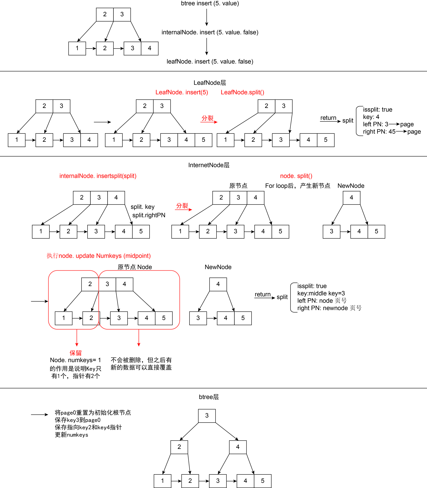

# B+ Tree

## 1. 重要关系

### **1.1 本项目中B+树度数(degree)为202,具体规则如下:**

- 每个非叶子节点最多有201个key索引和202个子节点(page)，每个叶子节点最多存201个key - value键值对，计算规则见3.2
- 每个非叶子节点(内部节点)至少有⌈203/2⌉个子节点
- 根节点至少有两个子节点,除非它是叶子节点
- 具有k个子节点的内部节点包含k-1个键值

一个完整degree为3的 B+ 树例子：

```css
             [10,  20]           <- Internal Node (根节点)       <---  
          /      |     \                                        <---
     [5,7]    [15,17]  [25,30]   <- Internal Nodes              <---            
    /  |  \    /  |  \   /  |  \                                <--- BTreeIndex
   L1  L2  L3  L4  L5 L6 L7  L8 L9  <- Leaf Nodes (存储实际数据)  <---
   |   |   |   |   |   |  |   |   |                             <---
   ------>----->----->--->--->---->  <- 叶子节点链表（单向链表）    <---
```

### 1.2 重要Helper Function

#### 1.2.1 getKeyAt

- 输入index后，由于每个key_size相同，因此我们可以通过对数据切片获取数据
- 类似对页数据的读取和修改的function都是通过这种切片的方法

```go
[KEYS_OFFSET(11字节)][KEY(10字节)][KEY2(10字节)]...
                    |<-- 切片 -->|
                    11           21
// getKeyAt 从内部节点的指定索引位置获取存储的键值
// 并发注意事项：调用此函数前，InternalNode的页面至少需要获得读锁
func (node *InternalNode) getKeyAt(index int64) int64 {
	// 1. 计算键值在页面中的起始位置
	// 使用 keyPos 函数计算第 index 个键值的偏移量
	// startPos = KEYS_OFFSET + index*KEY_SIZE
	startPos := keyPos(index)

	// 2. 从页面数据中读取并解码键值
	// - node.page.GetData() 获取整个页面的字节数据
	// - [startPos : startPos+KEY_SIZE] 截取出键值的字节片段
	// - binary.Varint 将字节序列解码成 int64 类型的键值
	key, _ := binary.Varint(node.page.GetData()[startPos : startPos+KEY_SIZE])

	// 3. 返回解码后的键值
	return key
}
```


## 2. BtreeIndex B+树索引

### 2.1 结构体

1. 包含了页管理器和初始化的root Page Number = 0。

2. 这里的BTreeIndex是Index接口的实现。BtreeIndex实现了Index接口所有的方法。在go中，只要一个类型实现接口定义的所有方法，它就隐式自动实现了这个接口，并不需要关心实现类的参数attributes有哪些。

   Java：显式implements实现接口，实现类实现接口所有方法，不同的实现类可以有不同的参数。

   Go：隐式实现接口，实现类实现接口所有方法，不同的实现类可以有不同的参数。

```go
// Index 接口定义的方法
type Index interface {
    Close() error
    GetName() string
    GetPager() *pager.Pager
    Find(int64) (entry.Entry, error)
    Insert(int64, int64) error
    Update(int64, int64) error
    Delete(int64) error
    Select() ([]entry.Entry, error)
    Print(io.Writer)
    PrintPN(int, io.Writer)
    CursorAtStart() (cursor.Cursor, error)
}

// BTreeIndex 实现了所有这些方法
type BTreeIndex struct {
    pager  *pager.Pager // The pager used to store the B+Tree's data.
    rootPN int64        // The pagenum of this B+Tree's root node.
}
func (index *BTreeIndex) Close() error { ... }
func (index *BTreeIndex) GetName() string { ... }
func (index *BTreeIndex) GetPager() *pager.Pager { ... }
func (index *BTreeIndex) Find(key int64) (entry.Entry, error) { ... }
func (index *BTreeIndex) Insert(key int64, value int64) error { ... }
func (index *BTreeIndex) Update(key int64, value int64) error { ... }
func (index *BTreeIndex) Delete(key int64) error { ... }
func (index *BTreeIndex) Select() ([]entry.Entry, error) { ... }
func (index *BTreeIndex) Print(w io.Writer) { ... }
func (index *BTreeIndex) PrintPN(pagenum int, w io.Writer) { ... }
func (index *BTreeIndex) CursorAtStart() (cursor.Cursor, error) { ... }
```

### 2.2. BtreeIndex Function

#### 2.2.1 Insert

```go
func (index *BTreeIndex) Insert(key int64, value int64)
```

**目的：插入entry键值对**

以插入 key5 为例，初始结构

               [key2,key3]
              /    |     \
        [key1]->[key2]->[key3,key4]

##### **A. 插入过程的调用链**

1. `BTreeIndex.Insert(5)`
2. -> `InternalNode[key2,key3].insert(5)`
3. -> `LeafNode[key3,key4].insert(5)`

##### **B. 完整流程**  

**1. 叶子节点插入和分裂**

- 调用链：`LeafNode[key3,key4].insert(5) -> LeafNode.split()`
- 分裂结果：`Split{key:key4, leftPN:key3的page, rightPN:key4的page}`，**这里返回的Split信息是上一层内部节点中插入的新的分隔键和指针（子节点页号）**

```
[key3,key4] -> [key3,key4,key5] -> [key3] | [key4,key5]

分裂后：
           [key2,key3]
          /    |     \
    [key1]->[key2]->[key3]->[key4,key5]   
```

**2. 内部节点处理分裂**

- 收到叶子节点的分隔键和指针信息：`Split{key:key4, leftPN:key3的page, rightPN:key4的page}`

- 在 [key2,key3] 中**插入 key4，插入指向叶子节点分裂信息中rightPN的指针（子节点页号）**

- 内部节点变为 [key2,key3,key4]

  ```
        [ key2  key3   key4 ]   
        /     |      |      \
  [key1]->[key2]->[key3]->[key4,key5]   
  ```

- 因超过节点最大容量（degree=3时最多2个键），需要分裂

**3. 内部节点分裂（见图片）**

   初始状态：

- 键：`[key2,key3,key4]`
- 指针：`[page1,page2,page3,page4]`

   分裂过程：

1. 计算分裂点

   - `midpoint = (3-1)/2 = 1`，即 key3 的位置

2. 创建新节点并转移数据，新的节点

      ```go
          [key4]
         /      \
      [key3]->[key4 key5]
      ```

3. 原节点数据处理

   - 执行 `node.updateNumKeys(midpoint)`，设置键数量为1
   - 数据特点：
     - 页中实际数据仍然是 `[key2,key3,key4]`
     - 因为 numKeys=1，只能访问到 key2
     - key3, key4 和其指向的节点虽然物理存在，但逻辑上不可访问
     - 这些"不可见"数据区域会在将来被新数据覆盖

4. 分裂结果

   Split{key:key3, leftPN: 原节点page, rightPN: 新节点的page}，这里返回的Split信息是新的上层节点的key和指针（子节点页号）

**4. 组装新的根节点**

- 因为是根节点分裂，需要创建新的根节点

- 特殊处理：根节点必须保持在页面0

- page 0保存key3

- 到page0保存指向key2页面和key4页面的指针

- 更新numKeys

- 最终树组装完成👇


```go
          [key3]         (页面0)
          /     \
      [key2]   [key4]    (其他页面)
      /    \    /    \
[key1]->[key2]->[key3]->[key4,key5]
```

**5. 图示**



#### 2.2.2 Select

```go
func (index *BTreeIndex) Select() ([]entry.Entry, error)
```

**目的：查询所有entries**

以遍历整棵树为例，初始结构:

```
          [key3]         (页面0)
          /     \
      [key2]   [key4]    (其他页面)
      /    \    /    \
[key1]->[key2]->[key3]->[key4,key5]
```

##### **A. 遍历过程的调用链**

1. `BTreeIndex.Select()`
2. -> `BTreeIndex.CursorAtStart()`
3. -> `BTreeCursor.GetEntry()` + `BTreeCursor.Next()`循环

##### **B. 完整流程**

**1. 获取起始位置的游标** 

调用链： `CursorAtStart() -> 从根向左遍历 -> 到达最左叶子节点`

```
        [key3]         
          /               从根开始
      [key2]              向左遍历      
      /     
[key1]->                  到达最左叶子
```

**2. 遍历所有叶子节点数据**

创建动态切片 entries 存储结果

循环处理:

- `cursor.GetEntry()` 获取当前条目

- 添加到结果集 `entries = append(entries, entry)`

- `cursor.Next()` 移动到下一个条目。这里分为游标在节点内或者节点间移动。节点间移动只需要将curIndex++即可。在节点间移动通过右邻居页号找到下一个节点，并初始化新起点的位置。

**3. 返回结果**

- 最终结果为动态切片 entries，包含所有叶子节点的键值对

#### 2.2.3 SelectRange

```go
func (index *BTreeIndex) SelectRange(startKey int64, endKey int64) ([]entry.Entry, error)
```

**目的：查询特定范围的entries，区间为[startKey, endKey)，包含 startKey，不包含 endKey**

以遍历查找startKey = key2, endKey = key4为例，初始结构:

```
           [key3]         (页面0)
          /     \
      [key2]   [key4]    (其他页面)
      /    \    /    \
[key1]->[key2]->[key3]->[key4,key5]
```

##### **A. 遍历过程的调用链**

`BTreeIndex.SelectRange()`

-> `BTreeIndex.CursorAt(startKey)`

-> `BTreeCursor.GetEntry()` + `BTreeCursor.Next()`循环

##### **B. 完整流程**

**1. 参数校验与初始化**

- 检查区间合法性：startKey < endKey
- 创建动态切片存储结果集

**2. 定位起始位置** 

调用链：`CursorAt(startKey) -> 从根向下查找 -> 定位到 startKey`

```
         [key3]
          /
     [key2]
     /    \
[key1]->[key2]  <-   游标指向Key2
```

**3. 遍历收集区间数据** 

循环处理直到遇到 endKey 或 B+ 树末尾：

- `cursor.GetEntry()` 获取当前条目

- 检查是否到达区间末尾（endKey > checkEntry.Key）

- 如未到达末尾：

  - 添加到结果集

  - `cursor.Next()` 移动到下一个位置

**4. 返回最终结果**

- 最终结果和Select类似为动态切片，包含特定范围的entries

#### 2.2.4 find

```go
func (index *BTreeIndex) Find(key int64) (entry.Entry, error)
```

**目的：查找指定key的entry** 以查找 key4 为例，初始结构:

```
           [key3]         (页面0)
          /     \
      [key2]   [key4]    (其他页面)
      /    \    /    \
[key1]->[key2]->[key3]->[key4,key5]
```

##### **A. 查找过程的调用链**

1. `BTreeIndex.Find()`
2. -> `Node.get()` （接口多态，实际执行的是内部节点或叶子节点的 get 方法）
3. -> 递归调用直到叶子节点

##### **B. 完整流程** 

**1. 从根节点开始查找**

```
       [key3]         
          \               key4 > key3
      --->  [key4]        向右子树查找      
            /     
        [key3]->[key4,key5]   找到目标叶子节点
```

**2. 在叶子节点中定位** 

- `node.search(key)`，二分查找定位位置

- `node.getEntry(index)` 获取条目

**3. 返回结果**

- 找到：返回对应的 Entry

- 未找到：返回错误 "no entry with key %d was found"

#### 2.2.5 update

```go
func (index *BTreeIndex) Update(key int64, value int64) error
```

**目的：更新指定key的value**

##### **A. 更新过程的调用链**

1. `BTreeIndex.Update()`
2. -> `Node.insert(key, value, update=true)` （复用insert方法，但设置 update 标志为 true）
3. -> 递归调用直到叶子节点

##### B. 完整流程

- 直接调用`Node.insert(key, value, update=true)`
- 只修改值，不改变树结构
- 在页面上更新数据

**3. 返回结果**

- 更新成功：返回 nil
- 键不存在：返回错误 "cannot update non-existent entry"

## 3. InternalNode

### 3.1 InternalNode (内部节点) 存储布局

假设一个包含2个键和3个子节点指针的内部节点：

- 键：`[10, 20]`
- 子节点指针：`[P1, P2, P3]`
- 子节点指针pointer实际存储的就是page number。
- **子节点指针比键多一个，因为P1指向 < 10的子树，P2指向 10 <= 子树 < 20，P3指向>=20的子树**
- **一个page4KB，非叶子节点不存放数据，只存放key作为索引**

```
+------------------------+  偏移量
| NodeHeader             |  0
| - nodeType = INTERNAL  |  // 1字节
| - numKeys = 202        |  // 10字节
+------------------------+  NODE_HEADER_SIZE = 11
| Keys Array             |
| - key1 = 10            |  // 10字节
| - key2 = 20            |  // 10字节
| - key3 = 30            |  // 10字节
|       ...              |
| - key201 = 2010        |  // 10字节
+------------------------+  KEYS_OFFSET(11) + 202*KEY_SIZE
| Page Number Array      |
| - page1                |  // 10字节
| - page2                |  // 10字节
| - page3                |  // 10字节
|       ...              |
| - page202              |  // 10字节
+------------------------+  PNS_OFFSET(2041) + 203*PN_SIZE

关键偏移量：
- NODE_HEADER_SIZE = 11  (1 + 10)
- KEYS_OFFSET = NODE_HEADER_SIZE = 11
- PNS_OFFSET = KEYS_OFFSET + (201 * 10)
- 总大小 = 4096字节(一个页面)
```

### 3.2 内部节点最多key数量公式

- 步骤1: 计算可用空间
  ptrSpace = pager.Pagesize - INTERNAL_NODE_HEADER_SIZE - KEY_SIZE
          = 4096 - 11 - 10
          = 4075

- 步骤2: 计算键数量

​	PN_SIZE：每个指针大小

​	**KEYS_PER_INTERNAL_NODE = (ptrSpace / (KEY_SIZE + PN_SIZE)) - 1 = (4075 / (10 + 10)) - 1 = 202个，实际代码中第202个键会分裂，最多存储201个键**

### 3.3 InternalNode Function

#### 3.3.1 Insert

```go
func (node *InternalNode) insert(key int64, value int64, update bool) (Split, error)
```

1. **查找插入位置**：

   - 使用二分查找找到第一个大于目标key的子节点位置。

   - 示例：现有键值对 `[2 3]`，插入 `5` → `childIdex = 2`。这里的二分查找获得的key的方法通过切片操作，计算公式是从Internal_Node_Header_Size + index * KEY_SIZE到Internal_Node_Header_Size + index * KEY_SIZE + KEY_SIZE。

   - 具体的字节布局：

     ```
     [页面头部(11字节)][Key1(10字节)][Key(10字节)]...
                     |<-- 切片 -->|
                     11          21
     ```

2. **获得目标子节点**：

   - 通过刚才找到的childIndex子节点下标，获得到孩子节点的pagenum页号。页号的计算和上一步的切片一样，通过PNS_OFFSET + index * PN_SIZE 到 PNS_OFFSET + index * PN_SIZE + PN_SIZE切片获得页号。
   - 孩子是通过找到子节点的页号，获得到页号就能找到页，将页转换成leafNode或者internalNode。
   - 根据go的语法，因为和internalNode共享一个node interface，所以可以找到的是leafNode，也可以是internalNode。

3. **获得页面管理器：**
   - 确保在函数返回时候释放页面资源，将没有被引用的页放入unpinnedList等待被刷盘后再次写入。

4. **执行递归插入**：
   - 在子节点中递归执行插入操作，调用本身insert()方法，得到result是一个split结构体。
   - 如果刚才第二步获得的节点是leafNode节点，这里调用的是leafNode里的insert方法。反之调用internalNode的insert继续递归执行。
   - 这里的base case是leafNode的insert方法，因为无论如何最后都会在叶子节点中插入。

5. **插入完成处理子节点分裂情况：**
   - 如果子节点发生了分裂，需要执行internalNode的node.insertSplit(result)插入新的键作为索引和子节点页的指针。
   - 如果插入后检查当前节点超过了一个页面最多key数限制，当前节点需要执行internalNode的node.split()方法，返回得到一个结构体，这个结构体中包含了向上提升的键和左页号与右页号。
   - 到返回Split结构体就已经结束，后面由btree的insert函数完成新的树的组装。

#### 3.3.2 InsertSplit

```go
func (node *InternalNode) insertSplit(split Split) (Split, error)
```

1. **查找插入位置**：

   - 用二分查找确定新键在当前节点中的插入位置
   - 示例：节点 `[key2,key3]`，插入 `key4` → `insertPos = 2`

2. **移动现有键和指针**：

   - 为新键和指针腾出空间，从右向左移动数据，避免覆盖

   - 移动键：

     ```
     [key2,key3] → [key2,key3,_]  // _表示空位
     ```

   - 移动指针：

     ```
     [page1,page2,page3] → [page1,page2,_,page3]
     ```

3. **插入新键和指针**：

   - 在腾出的位置插入新键：`node.updateKeyAt(insertPos, split.key)`
   - 插入新页号：`node.updatePNAt(insertPos+1, split.rightPN)`
   - 更新节点键数量：`node.updateNumKeys(node.numKeys + 1)`

4. **检查是否需要分裂**：

   - 如果键数量超过限制（degree=3时最多2个键），调用 `node.split()`
   - 否则返回空的 Split 结构体

#### 3.3.3 Split

```go
func (node *InternalNode) split() (Split, error)
```

1. **创建新节点**：

   - 通过页面管理器创建新的内部节点
   - 示例：分裂 `[key2,key3,key4]`，指针 `[page1,page2,page3,page4]`

2. **计算分裂点**：

   - `midpoint = (numKeys-1)/2`
   - 示例：`(3-1)/2 = 1`，key3 的位置

3. **转移数据到新节点**：

   - 转移分裂点之后的键和指针到新节点：

     ```
     - 原节点：[key2,key3,key4] → [key2]
     - 新节点：[] → [key4]
     ```

   - 数据存储特点：

     * 原节点通过 `updateNumKeys(midpoint)` 设置键数量
     * 页面保留原数据，但因 numKeys=1 只能访问 key2
     * key3、key4 虽然存在但逻辑上不可见
     * 这些数据区域将在未来写入时被覆盖

4. **返回分裂信息**：

   ```go
   return Split{
       isSplit: true,
       key:     middleKey,    // key3，将被提升到父节点
       leftPN:  node.page.GetPageNum(),  // 包含key2的页号
       rightPN: newNode.page.GetPageNum(),  // 包含key4的页号
   }
   ```

分裂结果：

- 左节点（原节点）：`[key2]`，指针：`[page1,page2]`
- 提升键：`key3`
- 右节点（新节点）：`[key4]`，指针：`[page3,page4]`

## 4. LeafNode

### 4.1 LeafNode (叶子节点) 存储布局

假设一个包含3个键值对的叶子节点：`(5,100), (8,200), (12,300)`

**一个page 4KB**

```css
+------------------------+  偏移量
| NodeHeader            |  0
| - nodeType = LEAF     |
| - numKeys = 3         |
+------------------------+  NODE_HEADER_SIZE = 11
| rightSiblingPN = 789  |  // 右兄弟页号
+------------------------+  RIGHT_SIBLING_PN_OFFSET(11) + RIGHT_SIBLING_PN_SIZE(10)
| Entry 1: (5,100)      |  // 第一个键值对
+------------------------+  LEAF_NODE_HEADER_SIZE(21) + ENTRYSIZE(20)
| Entry 2: (8,200)      |  // 第二个键值对
+------------------------+  LEAF_NODE_HEADER_SIZE + 2*ENTRYSIZE
| Entry 3: (12,300)     |  // 第三个键值对
+------------------------+  LEAF_NODE_HEADER_SIZE + 3*ENTRYSIZE
```

访问叶子节点数据的代码示例：

```go
// 获取键值对的位置
entryPos := LEAF_NODE_HEADER_SIZE + index*ENTRYSIZE
    
// 读取键值对
entry := entry.UnmarshalEntry(page.GetData()[entryPos : entryPos+ENTRYSIZE])
// page.GetData()[entryPos : entryPos+ENTRYSIZE]做了一个切片操作，获得20B特定index的键值对
[页面头部(21字节)][Entry1(20字节)][Entry2(20字节)]...
                  |<--  切片  -->|
                  21            41
// entry.Key = 5, 8, 或 12
// entry.Value = 100, 200, 或 300
```

### 4.2 每个叶子节点包含多少键值对公式

```go
ENTRIES_PER_LEAF_NODE = ((pager.Pagesize - LEAF_NODE_HEADER_SIZE) / ENTRYSIZE) - 1
```

`pager.Pagesize`: 整个页面的大小（4KB = 4096B）

`LEAF_NODE_HEADER_SIZE`: 叶子节点头部大小，包含NodeHeader（11B）、右兄弟指针（10B）（11 + 10 = 21B）

`ENTRYSIZE`: 每个键值对的大小（20B）

**ENTRIES_PER_LEAF_NODE = ((4096 - 21) / (20)) - 1 = 202个，实际代码中第202个键会分裂，最多存储201个键**

### 4.3 LeafNode Function

#### 4.3.1 Insert

```go
func (node *LeafNode) insert(key int64, value int64, update bool) (Split, error)
```

1. **查找插入位置**：
   - 使用二分查找确定新键值对的插入位置 `insertPos`。
   - 示例：现有键值对 `[10, 20, 30]`，插入 `25` → `insertPos = 2`。
2. **检查键是否存在**：
   - 如果 `insertPos < numKeys` 且 `node.getKeyAt(insertPos) == key`，表示键已存在。
     - 如果 `update = true`，更新现有键的值调用node.updateValueAt()并返回成功。
     - 如果 `update = false`，返回重复键错误。
   - 如果键不存在且 `update = true`，返回键不存在错误。
3. **插入新键值对**：
   - 从 `insertPos` 开始，将后续元素右移一位，腾出插入空间。
   - 在 `insertPos` 插入新条目。
   - 更新条目数量 `numKeys`。
4. **检查是否需要分裂**：
   - 如果 `numKeys >= ENTRIES_PER_LEAF_NODE(202)`，触发分裂操作：
     - 创建新节点。
     - 调整兄弟指针。
     - 转移条目：将原节点后半部分条目复制到新节点。调用node.updateKeyAt()和node.updateValueAt()，这两个function直接更新页数据来更新节点数据。
     - 调整条目数量：原节点保留前半部分，新节点获得后半部分。
     - 返回分裂信息：包含新节点的第一个键、原节点和新节点的页码。
   - 如果未分裂，返回成功。

#### 4.3.2 Split

```go
func (node *LeafNode) split() (Split, error)
```

1. **创建新叶子节点**：

   - 通过页管理器分配新页，调用 `createLeafNode(pager)` 初始化新节点。
   - **错误处理**：若创建失败（如无可用页），返回错误。
   - **资源释放**：通过 `defer pager.PutPage()` 确保新节点的页最终被释放。

2. **调整兄弟指针**：

   - **原节点右兄弟**：指向新节点（`newNode.page.GetPageNum()`）。

   - **新节点右兄弟**：继承原节点的旧右兄弟（`prevSiblingPN`）。

   - **目的**：维护叶子节点的横向链表结构。

     ```go
     prevSiblingPN := node.setRightSibling(newNode.page.GetPageNum())
     newNode.setRightSibling(prevSiblingPN)
     ```

3. **计算分裂中点**：

   - **公式**：`midpoint := node.numKeys / 2`。
   - **作用**：若原节点键数为偶数，分裂为两个相等节点；若为奇数，新节点多承载一个键。

4. **迁移条目到新节点**：

   - **循环范围**：从 `midpoint` 到 `node.numKeys - 1`。

   - **操作**：

     ```go
     for i := midpoint; i < node.numKeys; i++ {
         newNode.updateKeyAt(newNode.numKeys, node.getKeyAt(i))     // 复制键到新节点末尾
         newNode.updateValueAt(newNode.numKeys, node.getValueAt(i)) // 复制值到新节点末尾
         newNode.updateNumKeys(newNode.numKeys + 1)                 // 递增新节点条目数
     }
     ```

   - **底层数据操作**：

     - `updateKeyAt` 和 `updateValueAt` 直接修改新节点的页数据。
     - **示例**：原节点 `[10:100, 20:200, 25:250, 30:300]` → 迁移后新节点 `[25:250, 30:300]`。

5. **更新原节点条目数**：

   - **操作**：`node.updateNumKeys(midpoint)`。
   - **目的**：原节点仅保留前半部分键值对，之后新的数据对后半部分的key和指针进行覆盖。
   - **示例**：原节点 `numKeys` 从 `3` 更新为 `1`。

6. **返回分裂信息**：

   - **结构体字段**：

     ```go
     return Split{
         isSplit: true,
         key:     newNode.getKeyAt(0), // 新节点的第一个键（提升键）
         leftPN:  node.page.GetPageNum(),  // 原节点页号
         rightPN: newNode.page.GetPageNum(), // 新节点页号
     }, nil
     ```

   - **提升键逻辑**：新节点的第一个键作为父节点的新分隔键（B+树特性）。

## 5. Cursor

### 5.1 BTreeCursor结构体

```go
type BTreeCursor struct {
   index    *BTreeIndex // 此游标遍历的 B+ 树索引
   curNode  *LeafNode   // 游标当前指向的叶子节点
   curIndex int64       // 游标在当前节点内指向的索引位置
}
```

### 5.2 BTreeCursor Function

#### 5.2.1 CursorAtStart

```go
func (index *BTreeIndex) CursorAtStart() (cursor.Cursor, error)
```

**目的：创建一个指向 B+ 树最左侧叶子节点第一个条目的游标，为顺序遍历做准备。**

**1. 获取根节点**：

- 通过页面管理器获取根页面(index.rootPN = 0)
- 转换为节点格式

**2. 向左遍历直至叶子节点**：

- 从根节点开始循环向下遍历
- 每次获取最左子节点(索引0位置的子页号)
- 直到遇到叶子节点类型为止

**3. 创建并返回游标**：

- 初始化游标，将 curNode 指向找到的叶子节点
- 设置 curIndex = 0 指向第一个条目
- 如果是空节点，尝试移动到下一个非空节点

**4. 返回结构体字段**

```go
cursor := &BTreeCursor{
    index:    index,
    curIndex: 0, // 指向节点的第一个条目
    curNode:  leftmostNode,
}
```

#### 5.2.2 Next

```go
func (cursor *BTreeCursor) Next() (atEnd bool)
```

**目的：将游标移动到下一个条目，可以是同一节点内移动，也可以是跨节点移动。通过 rightSiblingPN 实现叶子节点间的顺序遍历。**

**1. 节点内移动**：

- 如果 curIndex+1 < numKeys，直接增加索引

**2. 节点间移动**：

- 获取右兄弟节点页号(rightSiblingPN)

- 如果没有右兄弟(页号<0)，表示到达末尾

- 否则切换到右兄弟节点并重置 curIndex = 0

  **返回 true 的情况**：

  - 当前节点没有右兄弟节点(rightSiblingPN < 0)，表示已到达最右叶子节点的末尾
  - 获取下一个节点页面失败时，视为到达末尾

  **返回 false 的情况**：

  - 在当前节点内移动成功（curIndex++)
  - 成功切换到右兄弟节点并重置位置（curIndex = 0）

#### 5.2.3 GetEntry

```go
func (cursor *BTreeCursor) GetEntry() (entry.Entry, error)
```

**目的：获取游标当前位置的条目数据，同时进行边界检查确保访问安全。**

**1. 边界检查**：

- 检查 curIndex 是否超过 numKeys
- 检查节点是否为空节点

**2. 获取数据**：

- 返回 curNode 中 curIndex 位置的条目

#### 5.2.4 CursorAt

```
func (index *BTreeIndex) CursorAt(key int64) (cursor.Cursor, error)
```

**目的：返回指定key的cursor结构体游标, 即找到指定 key 在 B+ 树中的位置，或者找不到时定位到下一个更大的 key。**

**1. 获得根节点，页面0的位置**

**2. for循环获得key所在叶子节点的位置**

- 这里用节点是否为internalNode作为for控制条件。如果是internalNode继续向下查找；如果找到非internalNode就是叶子节点，则停止查找

**3. 创建游标结构体**

```go
cursor := &BTreeCursor{
    index:    index,
    curIndex: curNode.search(key), // 在叶子节点中查找 key 的位置
    curNode:  curNode.(*LeafNode),
}
```

**4. 处理 key 不在当前节点的情况**

- 由于前面在内部节点search时，如果查找的叶子节点刚好也是内部节点索引的情况都返回左子树索引（具体见源代码注释的例子）
- 调用cursor.Next()移动到下一个叶子节点