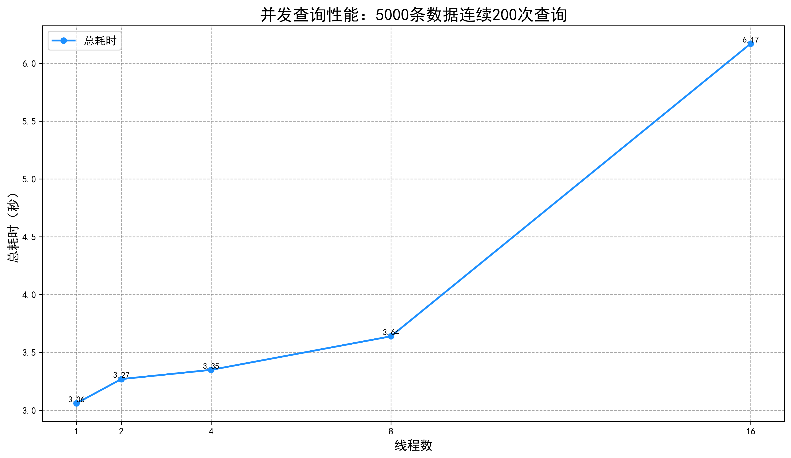

# Concurrency for B+ Tree

## 1. Insert

### 1.1 悲观锁爬行

#### A. 概念介绍

- 如果节点不会分裂（numKeys < max），则立即解锁父节点
- 如果节点可能分裂，保持父节点锁定直到分裂完成
- 获取子节点锁，递归到子节点后才释放父节点锁
- 使用的都是写锁

#### B. 执行流程

##### **a. 不分裂情况**

**插入key 45**


- 首先锁住20


- 再锁住35


- 锁住35后，检查该节点插入是否需要分裂。由于无需分裂，解锁父节点20。


- 继续锁住节点38-44。由于不确定节点38-44会不会分裂，所以不解锁节点35


- 锁住节点44


- 由于44不会分裂，所以向上解锁所有父节点。等到45插入完毕，解锁节点44-45


##### b. 分裂的情况

**插入25**


- 首先锁住20


- 再锁住35


- 锁住35后，检查该节点插入是否需要分裂。由于无需分裂，解锁父节点20。


- 锁住节点23 


- 解锁节点35，因为无需分裂


- 锁住节点23-31


- 完成新节点分裂后，从下往上解锁节点。**注意：新节点不会上锁，因为新创建的节点只对当前线程可见，其他线程无法访问这个新节点，所以不需要上锁。**


#### C. 测试方法

##### a. 基本测试

- 编译三个二进制文件

```go
# 编译服务器端
go build -buildvcs=false -o dinodb ./cmd/dinodb

# 编译客户端
go build -buildvcs=false -o dinodb_client ./cmd/dinodb_client

# 编译压力测试工具
go build -buildvcs=false -o dinodb_stress ./cmd/dinodb_stress
```

- 单个竞态文件测试命令

``` go
./dinodb_stress -index=btree -workload=workloads/i-a-sm.txt -n=8 -verify
```

- workload 文件类型：

  - i-a-sm.txt: 顺序小数据集 (ascending, small)

  - i-i-sm.txt: 乱序小数据集 (inconsecutive, small)

  - i-a-lg.txt: 顺序大数据集 (ascending, large)

  - i-i-lg.txt: 乱序大数据集 (inconsecutive, large)


- 完全测试测试命令

```
go test './test/concurrency/...' -race -timeout 180s -v
```

##### b. 正确性验证

- **键的顺序性**：检查所有键是否严格升序排列。
- **递归检查子节点**：对每个子节点递归调用`isBTree`，确保所有子节点均为合法B+树。

- **键与子节点边界的一致性**：若存在前一个键，该键必须**小于等于**子节点的左边界

- 使用小数据集

上述测试基于B+树的特性叶子节点的数据按键值顺序排列，通过右兄弟指针连接形成有序链表可以实现顺序遍历

##### c. 压力测试

- 单线程测试：一个线程执行所有插入操作

- 多线程测试：多个线程同时执行所有插入操作
- 使用大数据集

**1. 顺序插入10000条数据测试**


**2. 乱序插入10000条数据测试**

!

##### d. 补充说明

- 多线程压力测试下，不会出现多个线程执行同一条命令，因为每个线程从不同的起始位置（idx）开始,

  使用步长 n（线程总数）来跳跃式处理命令，例如，有 10 个命令，2 个线程时：

  - 线程0：处理第 0,2,4,6,8 号命令
  - 线程1：处理第 1,3,5,7,9 号命令

```go
// 工作负载分配函数
func handleWorkload(c chan string, wg *sync.WaitGroup, workload []string, idx int, n int) {
    defer wg.Done()
    // 每个线程从 idx 开始，步长为 n 处理命令
    for i := idx; i < len(workload); i += n {
        time.Sleep(jitter())
        c <- workload[i]
    }
}

// main 函数中的调用
for i := 0; i < *nFlag; i++ {
    wg.Add(1)
    go handleWorkload(c, &wg, workload, i, *nFlag)
}
```


## 2. Select和SelectRange

### 2.1 悲观读锁

#### A. 概念介绍

- 使用游标机制加读锁从最上到最下最左叶子节点开始顺序遍历，通过 defer cursor.Close() 确保锁的最终释放。
- 在移动游标时采用"**锁住旧节点，再锁新节点，再解锁旧节点，移动到新节点**"的策略，确保任意时刻至少有一个节点被锁住，保证遍历过程的一致性读。
- 采用悲观读锁（RLock）允许多个读操作并发执行，同时与写操作互斥，并通过最小锁范围（始终只锁一个节点）提高并发性能。

#### B. 执行流程

- 以Select为例

- 锁住头节点20


- 锁住节点10


- 释放节点20


- 相同的流程直到节点3-4，锁住3-4， 释放节点6


- 读取节点3-4后，锁住6-9


- 释放3-4后，执行相同流程直到结尾。


#### C. 测试方法

##### **a. 正确性测试**

- 插入5000条数据，执行Select
- 结果内容验证，验证每个期望的的条目是否在结果集中

##### **b. 性能测试**



- 简单增加线程数并不能线性提升性能 
- 8线程时出现性能显著下降
- 1-4线程间性能相对稳定
-  B+ 树的读锁虽然允许共享访问，但在高并发下仍存在性能瓶颈。