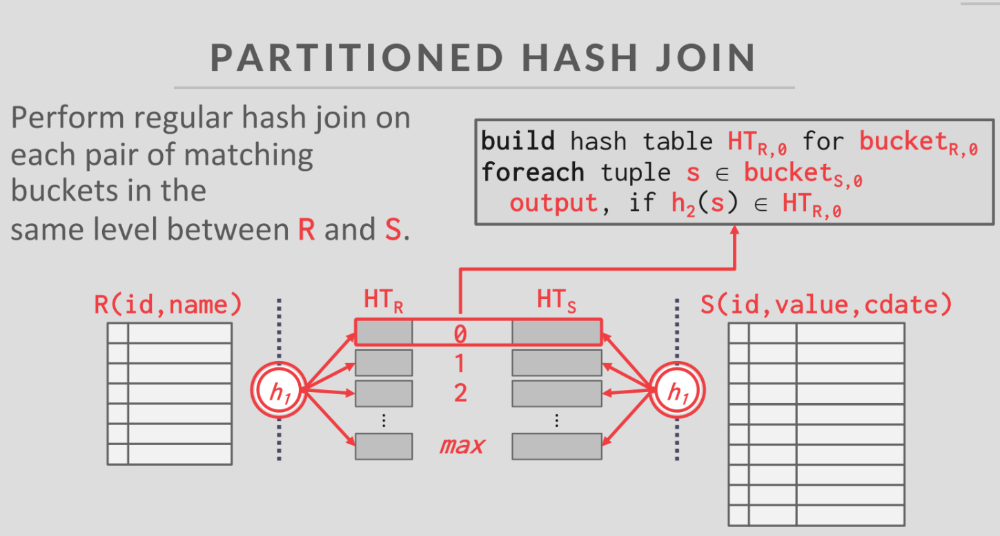

# Join

## 1. 重要概念

### 1.1 基本哈希连接

**1. 构建阶段**：

- 首先，选择其中一个表（通常是较小的表因为节省内存，这里假设是表R）作为构建表。
- 对表R中的每个元组，使用哈希函数h1计算其键（key）的哈希值。
- 将这个哈希值作为索引，将元组存储在哈希表HT_R的相应桶（bucket）中。

**2. 探测阶段：**

- 然后，对另一个表（这里是表S）中的每个元组，同样使用哈希函数h1计算其键的哈希值。
- 使用这个哈希值在哈希表HT_R中查找对应的桶。
- 如果找到匹配的桶，再在该桶中搜索具体的键，以确定是否有匹配的元组。
- 如果找到匹配的键，则将这两个元组连接起来并输出结果。

**3. 问题**

- 如果哈希表太大而无法完全放入内存，就需要将部分哈希表写入磁盘，这会显著降低性能。
- 假设表R: 100GB，表S: 200GB， 哈希表HT_R: 需要容纳整个R表的数据 ≈ 100GB。


### 1.2 分区哈希连接

**1. 分区构建阶段**：

- 将两个表（R和S）根据相同的哈希函数进行分区，使得具有相同哈希值的元组被分配到相同的分区中。
- 每个分区对应一个“桶”（bucket），R和S的分区数量相同。

- 对于每个分区，对表R的相应分区构建哈希索引（HT_R）。

**2. 探测阶段**：

- 对每个分区中的表R构建一个布隆过滤器。

- 对于S每个分区，遍历每个分区中的元组，首先使用布隆过滤器检查其连接键是否可能存在对应分区中。
- 使用相同的哈希函数计算表S元组的哈希值，并在对应的哈希表HT_R中查找匹配的元组。
- 如果找到匹配的元组，则输出连接结果。




## 2. Hash Join Function

### 2.1 Join

#### A. 参数介绍

```go
func Join(
    ctx context.Context,
    leftIndex database.Index,
    rightIndex database.Index,
    joinOnLeftKey bool,
    joinOnRightKey bool,
) (resultsChan chan EntryPair, ctxt context.Context, group *errgroup.Group, cleanupCallback func(), err error)
* 入参：
* ctx - 上下文，用于控制操作的取消
* leftIndex - 左表的索引
* rightIndex - 右表的索引
* joinOnLeftKey - 是否使用左表的key进行连接
*                 true: 使用key作为连接键
*                 false: 使用value作为连接键
* joinOnRightKey - 是否使用右表的key进行连接
*                  true: 使用key作为连接键
*                  false: 使用value作为连接键
*
* 返回值：
* resultsChan - 连接结果通道，每个结果是一个EntryPair
* ctxt - 返回的上下文，用于传递给调用者
* group - 错误组，用于处理并发操作的错误
* cleanupCallback - 清理函数，用于清理临时资源（临时哈希索引文件）
* err - 错误信息
```

#### B. 执行流程

以下数据为例子，本例 joinOnLeftKey 和 joinOnRightKey都为True

```
=== 插入的左表数据 ===
左表插入: key=0, value=0
左表插入: key=1, value=100
左表插入: key=2, value=200
左表插入: key=3, value=300
左表插入: key=4, value=400
左表插入: key=5, value=500
左表插入: key=6, value=600
左表插入: key=7, value=700
左表插入: key=8, value=800
左表插入: key=9, value=900

=== 插入的右表数据 ===
右表插入: key=5, value=500
右表插入: key=6, value=600
右表插入: key=11, value=1100

=== 预期的匹配 ===
预期匹配: 左表(5,500) 匹配 右表(5,500)
预期匹配: 左表(6,600) 匹配 右表(6,600)
```

##### 1. 创建左表和右表的哈希索引

- 根据 joinOnLeftKey和 joinOnRightKey 分别创造是key还是value作为连接键的哈希索引。如果为True的话哈希索引的连接键为Key，反之为Value。

- **调用执行buildHashIndex()创建左右两哈希索引。**创建完成的哈希索引如下

​									**左表临时哈希索引(初始)**

| **bucket[0] (pagenum=0)**    | **bucket[1] (pagenum=1)**    | **bucket[2] (pagenum=2)**    | **bucket[3] (pagenum=3)**    |
| :--------------------------- | :--------------------------- | :--------------------------- | :--------------------------- |
| `Bucket(0xc00011e528)`       | `Bucket(0xc00011e540)`       | `Bucket(0xc00011e558)`       | `Bucket(0xc00011e570)`       |
| ├── LocalDepth: 2            | ├── LocalDepth: 2            | ├── LocalDepth: 2            | ├── LocalDepth: 2            |
| ├── NumKeys: 2               | ├── NumKeys: 3               | ├── NumKeys: 3               | ├── NumKeys: 2               |
| └── Entries:                 | └── Entries:                 | └── Entries:                 | └── Entries:                 |
| ├── [0] {Key: 2, Value: 200} | ├── [0] {Key: 1, Value: 100} | ├── [0] {Key: 0, Value: 0}   | ├── [0] {Key: 5, Value: 500} |
| └── [1] {Key: 9, Value: 900} | ├── [1] {Key: 3, Value: 300} | ├── [1] {Key: 4, Value: 400} | └── [1] {Key: 6, Value: 600} |
|                              | └── [2] {Key: 8, Value: 800} | └── [2] {Key: 7, Value: 700} |                              |

​									**右表临时哈希索引(初始)**

| **bucket[0] (pagenum=0)** | **bucket[1] (pagenum=1)** | **bucket[2] (pagenum=2)**      | **bucket[3] (pagenum=3)**    |
| :------------------------ | :------------------------ | :----------------------------- | :--------------------------- |
| `Bucket(0xc00011e6a8)`    | `Bucket(0xc00011e6c0)`    | `Bucket(0xc00011e6d8)`         | `Bucket(0xc00011e6f0)`       |
| ├── LocalDepth: 2         | ├── LocalDepth: 2         | ├── LocalDepth: 2              | ├── LocalDepth: 2            |
| ├── NumKeys: 0            | ├── NumKeys: 0            | ├── NumKeys: 1                 | ├── NumKeys: 2               |
| └── Entries:              | └── Entries:              | └── Entries:                   | └── Entries:                 |
|                           |                           | └── [0] {Key: 11, Value: 1100} | ├── [0] {Key: 5, Value: 500} |
|                           |                           |                                | └── [1] {Key: 6, Value: 600} |

##### 2. 确保左右哈希索引相同全局深度

- 全局深度决定了哈希索引目录的大小(2^全局深度)，表示哈希索引目录的大小，有多少个buckets，可以通过哈希值的多少位来定位bucket。比如全局深度 = 2时，buckets的数量为2 ^ 2 = 4
- 左右两哈希索引扩展相同全局深度的目的是在探测(probe)阶段，每个bucket都有另一边相匹配的bucket对应。

- 注意：目录大小是2^全局深度，但实际的物理bucket数量可能更少，因为多个目录项可能指向同一个物理bucket。比如当一个bucket的LocalDepth小于GlobalDepth时，就会出现多个目录项指向同一个bucket的。

##### 3. 探测阶段

- 获得左右所有的buckets页号，存储形式是通过目录数组，存储bucket的页号
- 创建seen用来跳过重复配对的bucket pair，比如（以下例子非本例）

```
假设GlobalDepth=2，但某些bucket的LocalDepth仍为1:

leftBuckets = [0,0,1,1]   // 页号，LocalDepth=1导致两个目录项指向同一个物理bucket
rightBuckets = [0,0,1,1]   

处理过程：
1. i=0: pair{l:0, r:0} -> 首次遇到，加入seenList，处理这对bucket
2. i=1: pair{l:0, r:0} -> 已在seenList中，跳过（避免重复处理）
3. i=2: pair{l:1, r:1} -> 首次遇到，加入seenList，处理这对bucket
4. i=3: pair{l:1, r:1} -> 已在seenList中，跳过
```

- **获得左右表对应的bucket，执行probeBuckets()进行在关联bucket中匹配键值对**，得到两边bucket中相匹配的键值对。
- 最终通过resultsChan返回所有匹配的记录对。在本例中，只有两边的bucket[3]中有相匹配的key键，最终得到的结果结构体是：

```
type EntryPair struct {
    L entry.Entry  // 左表匹配记录
    R entry.Entry  // 右表匹配记录
}

具体结果：
EntryPair{
    L: Entry{Key: 5, Value: 500},
    R: Entry{Key: 5, Value: 500}
}
EntryPair{
    L: Entry{Key: 6, Value: 600},
    R: Entry{Key: 6, Value: 600}
}
```

### 2.2 buildHashIndex

#### A. 参数介绍

```go
func buildHashIndex(
    sourceIndex database.Index,
    useKey bool,
)
* 入参：
* sourceIndex - 表的索引
* useKey - 是否使用表的key进行连接
*          true: 使用key作为连接键
*          false: 使用value作为连接键
* 返回值：
* tempIndex - 返回构建的临时哈希索引，其中bucket的存储根据useKey决定使用原始记录的key还是value作为哈希键
* dbName - 临时数据库文件的名称，用于后续清理资源
* err - 错误信息
```

#### B. 执行流程

**1. 初始化临时存储**：

- 创建临时数据库文件获取dbName
- 使用dbName初始化临时哈希索引tempIndex

**2. 遍历源表数据**：

- 获取源表的游标cursor，用于遍历所有记录
- 通过cursor遍历每条记录

**3. 构建临时哈希索引**：

- 根据useKey决定使用原记录的key还是value作为新记录的key。

- 将新记录插入临时哈希索引

- **Insert()函数中会对新key进行哈希计算h1(key)，决定记录存储在哪个bucket**

  ```go
  // Insert 将一个键值对插入到哈希索引中
  func (table *HashTable) Insert(key int64, value int64) error {
     // 1. 计算哈希值，确定插入的bucket，Hasher为图中的h1
     hash := Hasher(key, table.globalDepth)  // 使用key和全局深度计算bucket索引
     
     // 2. 获取对应的bucket
     bucket, err := table.GetBucket(hash)
     if err != nil {
         return err
     }
  
     // 3. 将键值对插入bucket
     needSplit := bucket.Insert(key, value)  
  ```


**4. 返回结果**：

- 返回构建好的临时哈希索引tempIndex
- 返回临时数据库文件名dbName，供后续清理使用

### 2.3 probeBuckets

#### A. 参数介绍

```go
func probeBuckets(
   ctx context.Context,
   resultsChan chan EntryPair,
   lBucket *hash.HashBucket,
   rBucket *hash.HashBucket,
   joinOnLeftKey bool,  
   joinOnRightKey bool,
)
* 入参：
* ctx - 上下文，用于控制操作的取消
* resultsChan - 结果通道，用于发送匹配的记录对
* lBucket - 左表的bucket
* rBucket - 右表的bucket
* joinOnLeftKey - 是否使用左表记录的key进行连接
*                true: 使用key作为连接键
*                false: 使用value作为连接键
* joinOnRightKey - 是否使用右表记录的key进行连接
*                 true: 使用key作为连接键
*                 false: 使用value作为连接键
* 返回值：
* error - 错误信息
```

#### **B. 执行流程**

**1. 大表构建阶段**

- **注意：只有这里构建的是哈希表，而之前步骤构建的都是哈希索引**
- 根据左右bucket的大小选择大的bucket构建**哈希表和布隆过滤器。**
- 选择大bucket键值对中的key作为哈希表的key，整个键值对entry作为Value。

**2. 小表探测阶段**

- 遍历小表中的每个键值对，首先在大表的布隆过滤器查询key。如果在大表的布隆过滤器查不到key，说明大表中一定不存在与之相匹配的key，直接跳过查找。
- 如果布隆过滤器返回True说明大表可能有匹配的Key，继续在大表的哈希表中查找与之匹配的键值对
  - 如果查询到匹配的键值对，根据joinOnLeftKey和joinOnRightKey的布尔值是否调换Key和Value的位置，把两对匹配的键值对加入结果集。
  - 如果没有查询到匹配的键值对，说明布隆过滤器误报，则跳过继续处理下一个小表的键值对。

## 3. BloomFilter Function


#### A. 参数介绍

```go
func CreateFilter(size int64) (bf *BloomFilter)
* 入参：
* size - 布隆过滤器位数组的大小，默认1024位
* 返回值：
* bf - 返回初始化的布隆过滤器，包含一个size大小的位数组

* 示例：
filter := CreateFilter(1024)  // 创建一个1024位的布隆过滤器
```

```go
func (filter *BloomFilter) Insert(key int64)
* 入参：
* key - 要插入的键值
* 执行：
* 1. 使用两个不同的哈希函数计算位置：
*    - h1 = XxHash(key) % size
*    - h2 = MurmurHash(key) % size
* 2. 将这两个位置的比特设置为1

* 示例：
key=5时：
h1 = XxHash(5) % 1024 = 123    // 假设结果
h2 = MurmurHash(5) % 1024 = 456
将bits[123]和bits[456]设为1
```

```go
func (filter *BloomFilter) Contains(key int64) bool
* 入参：
* key - 要查找的键值
* 返回值：
* bool - true表示可能存在，false表示一定不存在
* 执行：
* 1. 使用相同的两个哈希函数计算位置
* 2. 检查这两个位置是否都为1
* 3. 都为1返回true，任一为0返回false

* 示例：
key=5时：
h1 = XxHash(5) % 1024 = 123
h2 = MurmurHash(5) % 1024 = 456
检查bits[123]和bits[456]：
- 都是1：返回true（可能存在）
- 任一为0：返回false（一定不存在）
```

#### B. 执行流程

**1. 创建布隆过滤器**

- 本项目中布隆过滤器大小为1024位。

**2. 插入键值**

- 用多种不同的哈希函数对key计算位置，将位置设为1

**3. 查询键值**

- 用和插入相同的哈希函数对key计算位置
  - 如果相应的位置全部为1，则数据库中可能存在相同的key
  - 但凡有一个位置不是1，则数据库中一定不存在相同的key
  - 布隆过滤器可能会误报存在key（即不存在的key），但一定不会漏报存在的key

#### **C. 性能分析**

- 布隆过滤器检查只需要访问两个bit位

- 哈希表查找需要计算哈希、处理冲突等

- 当大量记录不匹配时，布隆过滤器可以快速过滤掉这些记录

## 4. 测试方法

### A. 正确性测试

- 如上述例子，使用小数据集验证功能正确
- key-key, key-value, value-key连接正确
- 验证结果数量、结果值符合预期

### B. 性能测试

**a. 左表1000条数据，右表100条数据，不同疏密程度10次运行耗时**


**b. 左表10000条数据，右表1000条数据，不同疏密程度10次运行耗时**


- 随着数据量增加，执行时间呈线性增长 
- 在大数据量下，不同匹配率的性能非常稳定

- 小数据量时，匹配率对性能影响显著
- 大数据量时，匹配率的影响趋于平缓
