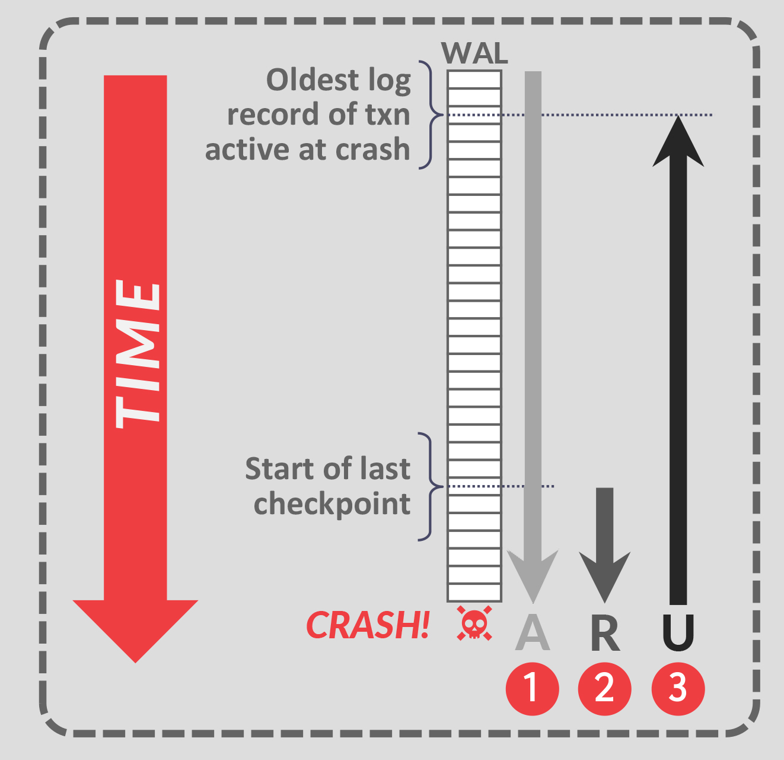
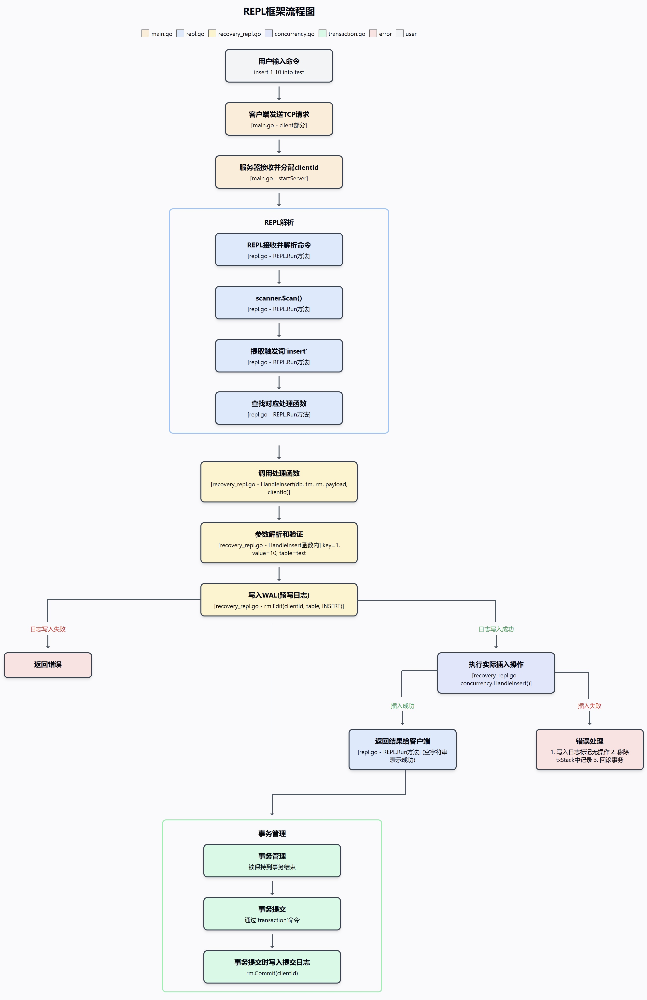

# RecoveryManager

# 1. 重要概念

## 1.1 WAL和ARIES恢复协议

- WAL（Write-Ahead Logging）和ARIES（Algorithm for Recovery and Isolation Exploiting Semantics）是数据库恢复系统的核心概念。本项目实现了简化版的ARIES协议，包含以下三个阶段：

### Phase #1 – 分析阶段 (Analysis)

- **从表开头识别崩溃时处于活跃状态的事务**
- 确定哪些表需要恢复，未提交活跃事务之后需要撤销
- 构建事务状态表，追踪每个事务的操作记录

### Phase #2 – 重做阶段 (Redo)

- **对所有事务不论是否提交都执行重做**
- 确保所有持久化的操作都被正确应用到数据库状态

### Phase #3 – 撤销阶段 (Undo)

- **逆序撤销所有未提交事务的所有操作，直到崩溃时活跃事务的最早日志操作记录**
- 最后标记所有未提交事务为已回滚

## 1.2 ARIES恢复图示解释



- 图中展示了ARIES恢复协议的关键元素：

  - **WAL日志**: 垂直的记录列表，按时间顺序从上到下排列

  - **TIME箭头**: 表示时间流向，从上到下

  - **Start of last checkpoint**: 最近的检查点位置，是恢复重做阶段的起点

  - **Oldest log record of txn active at crash**: 崩溃时仍活跃（未提交）事务的最早日志记录
    - 这是ARIES中的关键概念，它可能早于最近的检查点
    - 表示撤销阶段可能需要回滚到多远的历史
    - 例如：如果一个长时间运行的事务在检查点前就开始了，尽管其数据修改已经在检查点时刷新到磁盘，但由于事务未提交，恢复时仍需要**完全撤销该事务的所有操作**

## 1.3 WAL原则

- 任何修改数据库状态的操作**必须先写入日志，再执行实际操作**，主要为了：
  - **崩溃恢复**：日志可用于事务重做（REDO）或撤销（UNDO）。
  - **保障事务 ACID 特性**：确保原子性和持久性。
  - **提升磁盘 I/O 性能**：日志采用**顺序写**，比直接改数据库的随机写更高效。
  - **支持并发控制**：确保多个事务间的数据一致性。
  - **配合检查点：**优化恢复速度，避免从头回放整个日志。

- 实际代码示例：

```go
func HandleInsert(db *database.Database, tm *concurrency.TransactionManager, rm *RecoveryManager, payload string, clientId uuid.UUID) (err error) {
    // ...参数解析省略...
    // 先写日志
    err = rm.Edit(clientId, table, INSERT_ACTION, int64(key), 0, int64(newval))
    if err != nil {
        return err
    }
    
    // 后执行实际插入操作
    err = concurrency.HandleInsert(db, tm, payload, clientId)
    // ...错误处理...
    
    return err
}
```

## 1.4 日志文件结构

```go
type editLog struct {
    id        uuid.UUID // The id of the transaction this edit was done in
    tablename string    // The name of the table where the edit took place
    action    action    // The type of edit action taken
    key       int64     // The key of the tuple that was edited
    oldval    int64     // The old value before the edit
    newval    int64     // The new value after the edit
}
startLog{
		id: clientId, // 在start函数构造 
}
commitLog{
		id: clientId, // 在Commit函数构造
}
```

- 所有类型的日志（表创建、编辑、事务开始/提交、检查点）都按时间顺序写入**同一个日志文件, 所有表的所有日志都写入同一个表**

- 日志以文本形式存储，每条记录占一行
- 每次写入操作后立即调用`Sync()`确保日志持久化存储

- 日志示例：

  ```
  < create btree table students >
  < 123e4567-e89b-12d3-a456-426614174000 start >
  < 123e4567-e89b-12d3-a456-426614174000, students, INSERT, 10, 0, 100 >
  < 123e4567-e89b-12d3-a456-426614174000, students, UPDATE, 10, 100, 200 >
  < 123e4567-e89b-12d3-a456-426614174000 commit >
  < 456e7890-e89b-12d3-a456-426614174000 start >
  < 456e7890-e89b-12d3-a456-426614174000, students, INSERT, 20, 0, 300 >
  < 123e4567-e89b-12d3-a456-426614174000, 456e7890-e89b-12d3-a456-426614174000 checkpoint >
  < 789e0123-e89b-12d3-a456-426614174000 start >
  < 789e0123-e89b-12d3-a456-426614174000, students, INSERT, 30, 0, 400 >
  < 456e7890-e89b-12d3-a456-426614174000, students, DELETE, 20, 300, 0 >
  < 456e7890-e89b-12d3-a456-426614174000 commi-t >
  < 789e0123-e89b-12d3-a456-426614174000, students, UPDATE, 30, 400, 500 >
  ```

- 在恢复时，系统会从检查点checkpoint开始分析，识别活跃事务（此例中为事务789e0123），然后重做（此例中为事务456e7890）已提交事务的操作，最后撤销未提交（活跃）事务的操作。

# 2. 核心字段

```go
type RecoveryManager struct {
	db *database.Database              // 该恢复管理器负责的底层数据库
	tm *concurrency.TransactionManager // 用于该数据库的事务管理器

	// 跟踪所有未提交事务的操作
	// 将每个客户端/事务ID映射到日志栈
	txStack map[uuid.UUID][]editLog

	logFile *os.File   // 存储预写日志(WAL)的日志文件
	mtx     sync.Mutex // 用于保证该结构体可以被安全地并发使用的互斥锁
}
```

## 2.1 db

```go
db *database.Database
```

- 功能：指向底层数据库实例的指针

- 作用：允许RecoveryManager访问数据库的表、索引和其他数据结构

- 实现：在初始化RecoveryManager时传入，用于数据恢复和数据操作

- 示例：

```go
// 使用db字段访问数据库
tables := rm.db.GetTables()
table, err := rm.db.GetTable("users")
```

## 2.2 tm

```go
tm *concurrency.TransactionManager
```

- 功能：指向事务管理器的指针

- 作用：负责管理数据库事务，包括锁的获取和释放

- 实现：在初始化RecoveryManager时传入，用于事务操作

- 示例：

```go
// 使用tm字段管理事务
err := rm.tm.Begin(clientId)
err := rm.tm.Lock(clientId, table, key, concurrency.W_LOCK)
err := rm.tm.Commit(clientId)
```

## 2.3 txStack 

```go
txStack map[uuid.UUID][]editLog

type editLog struct {
    id        uuid.UUID // 事务ID
    tablename string    // 表名
    action    action    // 操作类型(INSERT/UPDATE/DELETE)
    key       int64     // 操作的键
    oldval    int64     // 操作前的值
    newval    int64     // 操作后的值
}
```

- 功能：维护所有未提交（活跃）事务的操作日志哈希表

- 作用：用于回滚操作和崩溃恢复，记录每个事务的所有修改操作

- 实现：使用事务ID作为键，editLog数组作为值的哈希表

- 结构示例：

```go
txStack = {
    "uuid1": [
        editLog{id: "uuid1", tablename: "users", action: INSERT_ACTION, key: 1, oldval: 0, newval: 100},
        editLog{id: "uuid1", tablename: "users", action: UPDATE_ACTION, key: 2, oldval: 50, newval: 150},
    ],
    "uuid2": [
        editLog{id: "uuid2", tablename: "orders", action: DELETE_ACTION, key: 5, oldval: 200, newval: 0},
    ]
}
```

- 操作示例：

```go
// 添加日志到事务栈
rm.txStack[clientId] = append(rm.txStack[clientId], el) // el = editLog

// 事务提交时删除对应日志栈
delete(rm.txStack, clientId)
```

## 2.4 logFile

```go
logFile *os.File
```

- 功能：指向预写日志(WAL)文件的文件指针

- 作用：用于持久化存储所有数据修改操作，确保崩溃恢复

- 实现：在初始化RecoveryManager时打开，使用追加模式写入

- 示例：

```go
// 写入日志到文件
_, err := rm.logFile.WriteString(log.toString())
err = rm.logFile.Sync() // 确保数据刷新到磁盘
```

## 2.5 mtx

- 功能：互斥锁，主要用于保护 txStack map 的并发访问
- 作用：确保多个事务不会同时读写 txStack，避免并发修改导致的数据不一致或程序崩溃
- 实现：标准 Go 互斥锁，用于同步访问

# 3. 核心函数

## 3.1 Table创建表对象

```go
func (rm *RecoveryManager) Table(tblType string, tblName string) error
```

### A. 参数介绍

- 参数：

  - `tblType string`：表的类型，通常为 "btree" 或 "hash"

  - `tblName string`：表的名称

- 返回：
  - `error`：如果日志写入失败，返回错误；否则返回 nil

- 目的：
  - 将**表创建操作**记录到预写日志(WAL)中，确保在系统崩溃和恢复时能重新创建表结构

- 说明：
  - 表创建日志不关联任何特定事务，因此不会被添加到 txStack 中
  - 此方法应在实际创建表后立即调用，确保表结构能被正确记录

### B. 完整流程

**1. 并发控制**

- 获取 `RecoveryManager`的互斥锁，保护对日志文件的写入日志到磁盘操作的线程安全

- 使用 defer 语句确保函数结束时释放锁，防止死锁

**2. 创建并写入日志对象**

- 创建 tableLog 结构体实例，将表类型和表名填入日志对象

  ```
  tl := tableLog{
      tblType: tblType,
      tblName: tblName,
  }
  ```

- 调用 `flushLog()`方法将日志序列化并写入日志文件，确保日志在实际数据修改前持久化存储（预写日志核心原则）

**3. 返回结果**

- 如果一切正常，返回 nil 表示操作成功

### C. 记录实例

- 执行`rm.Table("btree", "students")`，创建一个B+树类型的"students"表，日志文件会记录

  ```
  < create btree table students >

## 3.2 Start开启单个活跃事务

```go
func (rm *RecoveryManager) Start(clientId uuid.UUID) error
```

### A. 参数介绍

- 参数：
  - `clientId uuid.UUID`：要启动的事务/客户端的唯一标识符
- 返回：
  - `error`：如果日志写入失败，返回错误；否则返回 nil
- 目的：
  - 标记一个事务的开始，并将此事件记录到预写日志(WAL)中
  - 在txStack中创建一个空的事务操作键值对，用于跟踪该事务的之后所有修改操作
- 说明：
  - 每个事务在执行任何数据修改前必须先调用此方法
  - 开始日志在恢复过程中用于确定崩溃时哪些事务处于活跃状态

### B. 完整流程

**1. 并发控制**

- 获取 `RecoveryManager`的互斥锁，保护对共享资源的访问；用 defer 语句确保函数结束释放锁防止死锁

**2. 创建并写入日志对象**

- 创建 startLog 结构体实例，将客户端（事务）ID填入日志对象

  ```
  	sl := startLog{
  		id: clientId,
  	}
  ```

- 调用 `flushLog()`方法将日志序列化并写入日志文件落盘

**3. 初始化事务状态**

- 在 txStack 映射中为该事务创建一个空的编辑日志数组条目
- 此键值对将用于跟踪事务中的所有操作，以便在需要时进行回滚

**4. 返回结果**

- 如果操作成功，返回 nil
- 如果有错误发生，返回带上下文信息的错误

### C. 创建实例

- 执行`rm.Start(uuid.MustParse("123e4567-e89b-12d3-a456-426614174000"))`，启动一个新事务，日志文件会记录

  ```
  < 123e4567-e89b-12d3-a456-426614174000 start >
  ```

- 注：这里假设UUID值`123e4567-e89b-12d3-a456-426614174000`代表事务ID(tx1)

## 3.3 Edit单条编辑操作

```go
func (rm *RecoveryManager) Edit(clientId uuid.UUID, table database.Index, action action, key int64, oldval int64, newval int64) error
```

### A. 参数介绍

- 参数：
  - `clientId uuid.UUID`：客户端/事务的唯一标识符
  - `table database.Index`：要修改的表对象
  - `action action`：操作类型（INSERT_ACTION, UPDATE_ACTION, DELETE_ACTION）
  - `key int64`：要修改的记录键值
  - `oldval int64`：修改前的值（对于插入操作通常为0）
  - `newval int64`：修改后的值（对于删除操作通常为0）
- 返回：
  - `error`：如果日志写入失败，返回错误；否则返回 nil
- 目的：
  - 将数据修改操作记录到预写日志(WAL)中，确保在系统崩溃时能够恢复或回滚操作
- 说明：
  - 遵循WAL原则，必须先记录日志，再执行实际修改操作
  - 每个编辑日志都与特定事务关联，并存储在txStack中用于可能的回滚操作

### B. 完整流程

**1. 并发控制**

- 获取 `RecoveryManager`的互斥锁，保护对共享资源的访问；用 defer 语句确保函数结束释放锁防止死锁

**2. 创建并写入日志对象**

- 创建 editLog 结构体实例，填充事务ID、表名、操作类型、键值以及新旧值信息

  ```
  	el := editLog{
  		id:        clientId,
  		tablename: table.GetName(),
  		action:    action,
  		key:       key,
  		oldval:    oldval,
  		newval:    newval,
  	}
  ```

- 调用 `flushLog()`方法将日志序列化并立即写入日志文件落盘

**3. 更新事务状态**

- 检查txStack中是否已存在该事务的日志记录，如不存在则初始化
- 将当前编辑日志添加到对应事务的日志栈中，用于潜在的事务回滚

**4. 返回结果**

- 如果操作成功，返回 nil
- 如有错误发生，返回带上下文信息的错误

### C. 编辑实例

- 执行插入操作：`rm.Edit(tx1, studentsTable, INSERT_ACTION, 10, 0, 100)`，日志文件会记录

  ```
  < 123e4567-e89b-12d3-a456-426614174000, students, INSERT, 10, 0, 100 >
  ```

- 执行更新操作：`rm.Edit(tx1, studentsTable, UPDATE_ACTION, 10, 100, 200)`，日志文件会记录

  ```
  < 123e4567-e89b-12d3-a456-426614174000, students, UPDATE, 10, 100, 200 >
  ```

- 执行删除操作：`rm.Edit(tx1, studentsTable, DELETE_ACTION, 10, 200, 0)`，日志文件会记录

  ```
  < 123e4567-e89b-12d3-a456-426614174000, students, DELETE, 10, 200, 0 >
  ```

- 注：这里假设UUID值`123e4567-e89b-12d3-a456-426614174000`代表事务ID(tx1)

## 3.4 Commit提交单条事务

```go
func (rm *RecoveryManager) Commit(clientId uuid.UUID) error
```

### A. 参数介绍

- 参数：
  - `clientId uuid.UUID`：要提交的事务/客户端的唯一标识符
- 返回：
  - `error`：如果日志写入失败，返回错误；否则返回 nil
- 目的：
  - 标记一个事务的成功完成，并将此事件记录到预写日志(WAL)中
  - 从事务跟踪系统中移除该事务的操作记录
- 说明：
  - 每个事务完成所有操作后调用此方法确认事务已成功完成
  - 提交日志在恢复过程中用于确定哪些事务在崩溃前已成功完成
  - **提交操作不会立即将所有数据写入磁盘**，但确保所有操作将在恢复时重做

### B. 完整流程

**1. 并发控制**

- 获取 `RecoveryManager`的互斥锁，保护对共享资源的访问；用 defer 语句确保函数结束释放锁防止死锁

**2. 创建并写入日志对象**

- 创建 commitLog 结构体实，将客户端（事务ID）填入日志对象

  ```
  	cl := commitLog{
  		id: clientId,
  	}
  ```

- 调用 `flushLog()`方法将日志序列化并写入日志文件落盘

**3. 清理事务状态**

- 从 txStack 哈希表中删除该事务的条目
- 这表明该事务已成功完成，其操作不需要在回滚时撤销

**4. 返回结果**

- 如果操作成功，返回 nil
- 如果有错误发生，返回带上下文信息的错误

### C. 提交实例

- 执行`rm.Commit(uuid.MustParse("123e4567-e89b-12d3-a456-426614174000"))`，提交一个事务，日志文件会记录

  ```
  < 123e4567-e89b-12d3-a456-426614174000 commit >
  ```

## 3.5 Checkpoint所有事务刷盘

```go
func (rm *RecoveryManager) Checkpoint() error
```

### A. 参数介绍

- 参数：
  - 无参数
- 返回：
  - `error`：如果日志写入或页面刷新失败，返回错误；否则返回 nil
- 目的：
  - 创建数据库的一致性快照，将内存中的所有修改刷新到磁盘
  - 记录当前所有活跃（未提交）事务，为恢复提供起点
  - 备份数据库状态用于潜在的恢复
- 说明：
  - 减少系统崩溃后的恢复时间，只需重放检查点之后的日志
  - 与传统WAL实现不同，此实现不清理或截断日志文件

### B. 完整流程

**1. 并发控制**

- 获取 `RecoveryManager`的互斥锁，保护对共享资源的访问；用 defer 语句确保函数结束释放锁防止死锁

**2. 获取所有表**

- 调用 `db.GetTables()` 获取数据库中所有的表

**3. 刷新所有数据页到磁盘**

- 对每个表，获取其页面管理器(Pager)
- 锁定所有页面，进行刷盘操作，然后解锁
- **确保所有内存中的变更都持久化到磁盘**

**4. 收集活跃事务**

- 创建空的活跃事务ID列表
- 遍历 txStack 哈希表，收集所有未提交事务的ID

**5. 创建并写入检查点日志**

- 创建包含所有活跃事务ID的检查点日志对象

  ```
  	cl := checkpointLog{
  		ids: activeIds,
  	}
  ```

- 调用 `flushLog()` 确保日志被持久化到磁盘

**6. 备份数据库**

- 调用 `delta()` 方法创建数据库当前状态的备份
  - `delta()`函数实际创建了整个数据库文件的物理副本
- 复制所有数据文件到恢复目录，以便未来恢复使用

**7. 返回结果**

- 如果操作成功，返回 nil
- 如果有错误发生，返回带上下文信息的错误

### C. 记录实例

- 执行`rm.Checkpoint()`，当事务"123e4567"和"456e7890"活跃时，日志文件会记录

  ```
  < 123e4567-e89b-12d3-a456-426614174000, 456e7890-e89b-12d3-a456-426614174000 checkpoint >
  ```

- 如果没有活跃事务，则记录

  ```
  < checkpoint >
  ```


## 3.6 Redo单条命令重做

```go
func (rm *RecoveryManager) redo(log log) error
```

### A. 参数介绍

- 参数：
  - `log log`：要重做的日志条目，可以是tableLog或editLog类型
- 返回：
  - `error`：如果重做操作失败，返回错误；否则返回 nil
- **目的：**
  - **在恢复过程中重新执行日志中记录的操作，但不生成新的日志记录**
  - 用于将数据库状态恢复到崩溃前的一致状态
- 说明：
  - 专用于恢复过程，重做操作不会再次写入日志文件
  - 包含特殊的错误处理逻辑，处理可能由于系统状态不一致导致的操作失败

### B. 完整流程

**1. 使用`switch`类型断言处理不同类型的日志**

- 对于表创建日志(tableLog)
  - 构造表创建命令字符串
    - `payload := fmt.Sprintf("create %s table %s", log.tblType, log.tblName)`
  - 调用数据库处理函数执行表创建
  - 若失败则返回错误
- 对于编辑日志(editLog)，根据操作类型执行：
  - 插入操作(INSERT_ACTION)
    - 构造插入命令字符串
      - `payload := fmt.Sprintf("insert %v %v into %s", log.key, log.newval, log.tablename)`
    - 尝试执行插入`database.HandleInsert(rm.db, payload)`操作
      - 若插入失败（可能是键已存在），则尝试更新操作
      - 若更新也失败，返回错误
  - 更新操作(UPDATE_ACTION)
    - 构造更新命令字符串
      - `payload := fmt.Sprintf("update %s %v %v", log.tablename, log.key, log.newval)`
    - 尝试执行更新`database.HandleUpdate(rm.db, payload)`操作
      - 若更新失败（可能是键不存在），则尝试插入操作
  - 删除操作(DELETE_ACTION)
    - 构造删除命令字符串
      - `payload := fmt.Sprintf("delete %v from %s", log.key, log.tablename)`
    - 执行删除`database.HandleDelete(rm.db, payload)`操作
- 对于不支持的日志类型
  - 返回错误，说明只能重做表创建或编辑日志

**2. 返回结果**

- 如果所有操作成功执行，返回 nil
- 如果有错误发生，返回相应错误

### C. 恢复实例

- 当重做表创建日志时：

  ```
  < create btree table students >
  ```

  1. 执行`create btree table students`
  2. 如果表已存在，返回错误，恢复过程会忽略此错误继续执行

- 当重做插入操作时：

  ```
  < 123e4567-e89b-12d3-a456-426614174000, students, INSERT, 10, 0, 100 >
  ```

  1. 尝试执行`insert 10 100 into students`
  2. 如果该键已存在，则尝试执行`update students 10 100`

- 当重做更新操作时：

  ```
  < 123e4567-e89b-12d3-a456-426614174000, students, UPDATE, 10, 100, 200 >
  ```

  1. 尝试执行`update students 10 200`
  2. 如果记录不存在，则尝试执行`insert 10 200 into students`

- 当重做删除操作时：

  ```
  < 123e4567-e89b-12d3-a456-426614174000, students, DELETE, 10, 100, 0 >
  ```

  1. 执行`delete 10 from students`
  2. 如果记录不存在，返回错误，恢复过程会处理此错误

## 3.7 Undo单条命令撤销

```go
func (rm *RecoveryManager) undo(log editLog) error
```

### A. 参数介绍

- 参数：
  - `log editLog`：需要撤销的编辑日志记录

- **返回：**
  - `error`：如果撤销操作失败，返回相应错误；操作成功则返回 `nil`。

- **目的：**
  - **执行与编辑日志中记录的操作相反的操作，以撤销之前对数据库的修改，从而帮助数据库回滚到一致状态。**

- **说明：**

  - 撤销操作专用于恢复和事务回滚过程中。

  - 根据操作类型，构造相应的撤销命令（如删除、更新或插入），并调用对应的处理函数来完成操作。

### B. 完整流程

**1. 使用`switch`类型断言处理不同类型的日志**

- **对于插入操作 (`INSERT_ACTION`):**

  - 原操作为插入记录，撤销时需要删除该记录。

  - 构造命令字符串：
    `payload := fmt.Sprintf("delete %v from %s", log.key, log.tablename)`

  - 调用函数：`HandleDelete(rm.db, rm.tm, rm, payload, log.id)`

- **对于更新操作 (`UPDATE_ACTION`):**

  - 原操作为更新记录，撤销时需要将记录的值恢复为修改前的旧值。

  - 构造命令字符串：
    `payload := fmt.Sprintf("update %s %v %v", log.tablename, log.key, log.oldval)`

  - 调用函数：`HandleUpdate(rm.db, rm.tm, rm, payload, log.id)`

- **对于删除操作 (`DELETE_ACTION`):**

  - 原操作为删除记录，撤销时需要重新插入该记录，并恢复其旧值。

  - 构造命令字符串：
    `payload := fmt.Sprintf("insert %v %v into %s", log.key, log.oldval, log.tablename)`

  - 调用函数：`HandleInsert(rm.db, rm.tm, rm, payload, log.id)`

**2. 错误处理**

- 对于每种操作，如果对应的处理函数返回错误，则立即返回该错误。
- 若所有撤销操作均成功执行，则返回 `nil`。

### C. 撤销实例

- **撤销插入操作：**

  （以下log为日志记录，而非实际函数调用）

  ```
  < 123e4567-e89b-12d3-a456-426614174000, students, INSERT, 10, 0, 100 >
  ```

  1. 撤销操作构造命令：`delete 10 from students`。
  2. 调用 `HandleDelete` 删除记录，从而撤销之前的插入操作。

- **撤销更新操作：**

  ```
  < 123e4567-e89b-12d3-a456-426614174000, students, UPDATE, 10, 100, 200 >
  ```

  1. 撤销操作构造命令：`update students 10 100`。
  2. 调用 `HandleUpdate` 将记录恢复到更新前的旧值。

- **撤销删除操作：**

  ```
  < 123e4567-e89b-12d3-a456-426614174000, students, DELETE, 10, 100, 0 >
  ```

  1. 撤销操作构造命令：`insert 10 100 into students`。
  2. 调用 `HandleInsert` 重新插入记录，从而撤销删除操作。

## 3.8 Recover崩溃后恢复

```go
func (rm *RecoveryManager) Recover() error
```

### A. 参数介绍

- 参数：
  - 无。
- 返回：
  - `error`：如果恢复过程中发生错误，则返回错误；否则返回 `nil`。
- **目的：**
  - **在数据库启动时，通过读取预写日志（WAL），将数据库状态恢复到崩溃前的一致状态。**
  - **包括重做已提交事务的操作和撤销未提交事务的操作，确保数据一致性。**

### B. 完整流程

**1. 获取互斥锁**

- 调用 `rm.mtx.Lock()` 确保恢复过程的线程安全，结束时通过 `defer rm.mtx.Unlock()` 释放锁。

**2. 读取日志和检查点**

- 调用内部函数 `rm.readLogs()` 读取所有日志记录和最近检查点的位置。
- 如果读取日志出错，立即返回错误。

**3. 初始化事务状态追踪**

- `activeTransactions`：
  - 定义为 `map[uuid.UUID]bool`哈希表，用于标记所有在恢复过程中处于活跃状态的事务。
  - 在遍历日志时，对于每个 `startLog`，将对应事务的 ID 标记为活跃；遇到 `commitLog` 则从该映射中删除对应事务。

- `transactionLogs`：

  - 定义为 `map[uuid.UUID][]editLog`哈希表，用于按事务 ID 分类保存所有编辑日志，和事务是否活跃无关。

  - 遍历日志过程中，将每个 `editLog` 按事务 ID 存入该映射，以便后续在重做或撤销阶段处理该事务的所有操作。

**4. 第一阶段：分析 - 确定活跃事务和重建表结构**

- **目的**：通过扫描日志确定崩溃时哪些事务处于活跃状态，建立事务日志记录哈希表，并重建表结构。
- 遍历日志记录（检查点前和检查点后）：
  - **startLog**：标记事务为活跃；如果是检查点后遇到的startLog，还会清除该事务先前的编辑日志（表示事务重新开始）。
  - **commitLog**：移除相应事务的活跃标记。
  - **tableLog**：调用 `rm.redo(l)` 重做表创建操作；若返回错误且不包含"already exists"，则返回错误。
  - **editLog**：将编辑日志记录追加到 `transactionLogs` 中，按事务 ID 分类存储。

- **如何确定活跃事务：**

  - 遇到 `startLog`：将事务标记为活跃 (`activeTransactions[id] = true`)

  - 遇到 `commitLog`：移除事务的活跃标记 (`delete(activeTransactions, id)`)，commit之后就是非活跃事务

**5. 第二阶段：重做 - 重做检查点之后的编辑操作**

- **目的**：重放检查点后的所有操作，将数据库物理状态恢复到崩溃前的状态，无论事务是否提交。

- 重做检查点后的编辑日志：
  - 检查点保证了之前所有的数据变更已被刷新到磁盘，故检查点前的编辑操作无需重做。
  - 对每个检查点后的编辑日志调用 `rm.redo(editLog)`，执行相应操作。
  - 忽略特定类型的预期错误（如"already exists"或"doesn't exist"）。

**6. 第三阶段：撤销 - 回滚所有活跃（未提交）事务**

- **目的**：回滚所有未提交事务的操作，确保数据库的逻辑一致性，只保留已提交事务的效果。
- 遍历`activeTransactions`中的所有事务ID：
  - 获取该事务在 `transactionLogs` 中所有记录的编辑操作。
  - 按照逆序（从最新到最旧）遍历并撤销每个操作：
    - **INSERT_ACTION**：执行删除操作，撤销插入。
    - **UPDATE_ACTION**：尝试更新回原值；若失败，尝试插入原值。
    - **DELETE_ACTION**：重新插入被删除的记录。
  - 对每个撤销的事务，写入一条 `commitLog` 日志，标记该事务已被回滚。

**7. 清理和同步**

- 重置 `rm.txStack` 为空映射，清除所有事务状态。
- 调用 `rm.logFile.Sync()` 确保所有新写入的日志被刷新到磁盘。

**8. 返回结果**

- 如果恢复过程成功完成，返回 `nil`。
- 如果任何阶段发生错误，返回相应的错误信息。

### C. 设计考量

**1. 为什么不直接复用txStack而是从日志重建**

- **日志是唯一可靠来源**：WAL系统设计中，日志是唯一被保证持久化的完整操作记录。在实际崩溃时，内存中的所有数据结构（包括`txStack`）都会丢失。恢复代码必须模拟这种真实情况，仅依赖持久化存储上的信息。
- **符合ARIES协议**：标准ARIES协议明确规定恢复过程必须从日志重建状态，不能依赖崩溃前的易失性存储。

**2. 为什么分析阶段从日志开头而非检查点开始**

- **处理跨检查点的长事务**：事务可能在检查点前开始，但在崩溃时仍未提交。必须从事务开始点记录所有操作，以便正确撤销该事务的全部效果，维护原子性（要求事务要么完全提交，要么完全不提交）。

  - 举例：

    - 事务T1在检查点前开始插入记录A
    - 检查点发生（记录T1为活跃事务）

    - 系统崩溃

  - 如果只考虑检查点后的操作，我们将无法撤销记录A的插入，导致数据库状态不一致。

- **ARIES协议标准**：ARIES要求定位所有活跃事务的最早日志记录（可能在检查点之前很远），以确保完整的撤销操作序列。

### D. 恢复示例

- 当数据库在事务 T1 提交后、事务 T2 未提交时崩溃：
  1. **分析阶段**：发现 T1 已提交，T2 活跃。
  2. **重做阶段**：重做检查点后的所有操作，包括 T1 和 T2 的操作。
  3. **撤销阶段**：逆序撤销 T2 的所有操作，包括检查点之前的，保留 T1 的操作。
  4. 结果：数据库状态恢复为只包含 T1 提交的更改。

## 3.9 Rollback主动回滚

```go
func (rm *RecoveryManager) Rollback(clientId uuid.UUID) error
```

### A. 参数介绍

- 参数：
  - `clientId uuid.UUID`：要回滚的事务/客户端的唯一标识符
- 返回：
  - `error`：如果回滚过程中发生错误，则返回错误；否则返回 `nil`
- **目的：**
  - **在客户端主动调用 `abort` 命令时执行**
  - **撤销当前未提交事务的所有操作，将数据库恢复到事务开始前的状态**

### B. 完整流程

**1. 获取互斥锁**

- 调用 `rm.mtx.Lock()` 确保回滚过程的线程安全，结束时通过 `defer rm.mtx.Unlock()` 释放锁

**2. 验证事务存在**

- 检查 `txStack` 中是否存在指定 `clientId` 的事务记录
- 如果不存在，返回错误："no transaction found for client..."

**3. 收集所需的锁**

- 创建自定义的 `lockInfo` 结构来跟踪需要锁定的表和键

- 遍历事务的所有日志记录，为每个受影响的表和键创建一个锁信息

- 收集过程中如果无法获取表，返回相应错误

- 创建`locksNeeded` ，是 `lockInfo` 结构体的切片(数组)，用于记录需要上锁的表的其中的key

  `locksNeeded`示例：

  ```
  locksNeeded = [
      {table: <students表>, key: 10},  // 第一次操作
      {table: <students表>, key: 10},  // 第二次操作(重复)
      {table: <courses表>, key: 20},
      {table: <students表>, key: 15}
  ]
  ```

**4. 释放现有事务的锁**

- 通过调用 `rm.tm.Commit(clientId)` 结束当前事务，释放已获取的所有锁
- 如果释放过程失败，返回错误

**5. 开始新事务用于回滚**

- 调用 `rm.tm.Begin(clientId)` 创建新事务（复用的原事务UUID），专用于回滚操作
- 如果事务创建失败，返回错误

**6. 排序锁以防止死锁**

- 按表名和键值对所需的锁进行排序，确保锁获取顺序一致

- 先按表名排序，对同一表内的锁按键值排序

- 这种方法有效防止多事务间的死锁

  `locksNeeded`锁排序后示例

  ```
  locksNeeded = [
      {table: <courses表对象引用>, key: 20},     // 按表名排序，"courses" < "students"
      {table: <students表对象引用>, key: 10},    // 同表按键值排序
      {table: <students表对象引用>, key: 10},    // 重复的键保持相对顺序
      {table: <students表对象引用>, key: 15}
  ]
  ```

**7. 获取所有必要的锁**

- 按排序后的顺序获取每个表和键的写锁
- 如果任何锁获取失败，提交事务以释放已获取的锁，并返回错误

**8. 执行回滚操作**

- 逆序（从最新到最早）遍历事务的所有操作日志
- 对每种操作类型执行相反的操作：
  - **INSERT_ACTION**：删除已插入的记录
  - **UPDATE_ACTION**：将已更新的记录恢复到原值
  - **DELETE_ACTION**：重新插入已删除的记录
- 如果任何撤销操作失败，提交事务释放锁，并返回错误

**9. 记录回滚完成**

- 创建 `commitLog` 记录，标记事务已回滚

- 调用 `rm.flushLog(cl)` 将回滚记录写入日志文件

  示例：

  ```
  < 123e4567-e89b-12d3-a456-426614174000 commit >
  ```

- 如果写入日志失败，提交事务释放锁，并返回错误

**10. 清理事务状态**

- 从 `txStack` 中删除该事务的记录

**11. 提交回滚事务**

- 调用 `rm.tm.Commit(clientId)` 提交回滚事务，释放所有锁
- 如果提交失败，返回错误

**12. 返回结果**

- 如果回滚过程成功完成，返回 `nil`
- 如果任何阶段发生错误，返回相应的错误信息

### C. 设计考量

**1. 两阶段锁机制**

- 该实现使用两阶段锁定策略：先获取所有必要的锁，然后执行所有撤销操作，最后释放锁
- 通过对锁进行排序获取，有效避免死锁问题

**2. 事务隔离**

- 回滚操作在单独的事务中执行，确保原子性和隔离性
- 即使在回滚过程中发生错误，已获取的锁也能被正确释放

**3. 记录回滚操作**

- 通过写入 `commitLog` 将回滚操作记录到日志中
- 确保即使在后续系统崩溃中，也能正确识别该事务已被回滚

### D. 回滚示例

- 假设事务包含以下操作序列：

  1. 在students表中插入记录 (10, 100)

  2. 在students表中更新记录为 (10, 200)

  3. 在courses表中删除记录 (20, 300)

- 在客户端主动调用abort命令执行回滚操作时，操作将按以下顺序执行：

  1. 在courses表中重新插入记录 (20, 300) - 撤销删除

  2. 在students表中更新记录回 (10, 100) - 撤销更新

  3. 在students表中删除记录 (10, 100) - 撤销插入

- 完成后，系统状态将恢复到事务开始前的状态。

# 4. 测试

**1. 基本功能测试 (testBasic)**

- 验证简单事务的创建、插入和提交操作是否正常工作
- 确保基本的WAL日志记录功能正常

**2. 事务中止测试 (testAbort)**

- 验证空事务（未执行任何操作）的回滚功能
- 测试回滚过程中的日志记录和事务状态清理

**3. 插入后中止测试 (testInsertAbort)**

- 测试在执行插入操作后中止事务的场景
- 验证插入操作是否被正确撤销，确保数据不存在

**4. 复合操作中止测试 (testAbortInsertDeleteAndUpdate)**

- 测试事务执行一系列复杂操作（插入、更新、删除）后的回滚
- 验证所有操作是否能正确撤销，恢复到初始状态

**5. 事务隔离测试 (testAbortIsolated)**

- 测试多个并发事务的隔离性
- 验证一个事务的回滚不会影响其他事务的数据

**6. 插入删除提交测试 (testInsertDeleteCommit)**

- 测试插入然后删除同一记录并提交后的崩溃恢复
- 验证已删除的记录在恢复后确实不存在

**7. 插入提交更新崩溃测试 (testInsertCommitUpdate)**

- 测试先提交插入，然后更新但未提交时崩溃的情况
- 验证恢复后只有已提交的插入操作生效，未提交的更新被撤销

**8. 检查点交互测试 (testInsertCheckpointCommitUpdate)**

- 测试插入、检查点、提交、更新的复杂交互
- 验证检查点正确保存已刷新的数据，同时未提交更新被正确撤销

**9. 多表操作测试 (testMultipleTablesOneClient)**

- 测试同一事务操作多个表的场景和崩溃恢复
- 验证跨表事务的一致性和正确恢复

**10. 大量操作检查点测试 (testMultiInsertCheckpointing)**

- 测试大量插入操作(500条)期间执行多次检查点但不提交
- 验证未提交事务的所有操作在崩溃后都被正确撤销，即使已执行检查点

**11. 复杂检查点提交测试 (testMultiInsertCommitDeleteCheckpointing)**

- 测试大量插入并提交，然后大量删除但未提交，期间执行多次检查点
- 验证崩溃后，已提交的插入被保留，未提交的删除被撤销

# 5. REPL 框架



# 6. RecoveryManager vs TransactionManager

**RecoveryManager的commit和rollback:**

1. 数据一致性层面：关注数据持久化和恢复
2. 操作流程
   - Commit: 记录提交日志，清理内存中的事务操作栈
   - Rollback: 物理撤销已执行的数据库操作，反向执行每步操作

**TransactionManager的commit和rollback:**

1. 并发控制层面：关注锁管理和事务隔离
2. 操作流程
   - Commit: 释放事务持有的所有资源锁，从事务管理器中移除事务
   - Rollback: 同样释放锁并移除事务，但语义上表示事务失败

**主要区别:**

1. 职责不同
   - RecoveryManager: 通过WAL处理数据持久化和恢复，确保事务的原子性和持久性
   - TransactionManager: 通过严格两阶段锁定协议(Strict 2PL)处理并发控制，确保隔离性
2. 处理对象不同
   - RecoveryManager: 处理数据操作日志(editLog)
   - TransactionManager: 处理资源锁(lockedResources)
3. 回滚实现不同
   - RecoveryManager: 需执行反向操作(插入→删除，更新→更新回旧值，删除→插入)
   - TransactionManager: 仅释放锁，不处理实际数据
4. 恢复机制
   - RecoveryManager: 有完整的三阶段恢复流程(分析、重做、撤销)
   - TransactionManager: 无系统崩溃恢复机制，专注于运行时并发控制

**总结：**

两者协同工作确保ACID特性：TransactionManager的锁管理确保事务隔离，RecoveryManager的日志机制确保事务的原子性和持久性，共同维护数据一致性。
